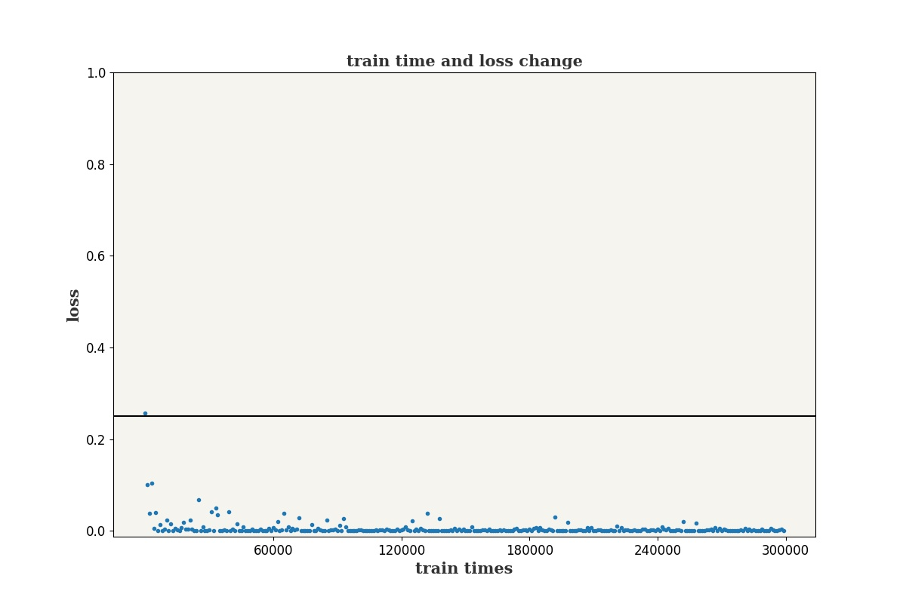

# MAIN2

a neural network for discriminating the handwriting digits

## 1 structure of the net

using MNIST dataset,the configuration of the neural net as below:

+ input:784(28×28)
+ hidden layer1: 784×200
+ output layer:  200×10
+ loss function: BCELoss
+ activation function:leaky relu

## 2 experiment result on MNIST

<div align="center">

</div>

best performance on MNIST is 99.87%[<sup>[1]</sup>](#1)
the performance of this discriminator is 0.98845

## 3 issues

### 3.1 UserWarning: The given NumPy array is not writeable, and PyTorch does not support non-writeable tensors.

solutions:

```
def read_sn3_pascalvincent_tensor(path: str, strict: bool = True) -> torch.Tensor:
    ......
    return torch.from_numpy(parsed.astype(m[2]，copy=False)).view(*s)
```

remove copy=False in line 3

### 3.2

# systemTool

use matplotlib to visualize the loss

# main1

使用GAN生成0101模式的数据


# imageProcess
test the convolution result of the image
# future work

## plan

+ decrease train set size in MNIST dataset to watch the performance decrease. And the turning point should be found.
+ use limited data to generate new labeled data to expand the volume to the turning point.
+ the adam optimisor

## question

+ question1: can GAN generate new data from limited dataset?
+ question2: will the data be valid by transforming the data manually？
+ question3: How to use prior knowledge to train the model?

## <center>references</center>

<div id = "1"></div>

[1] Byerly, Adam, T. Kalganova and I. Dear. “No Routing Needed Between Capsules.” (2020).


